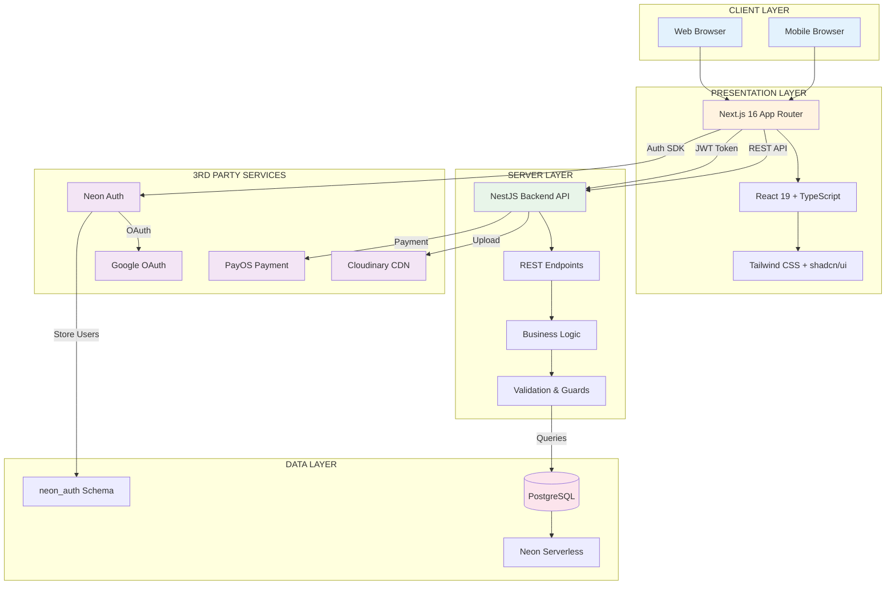
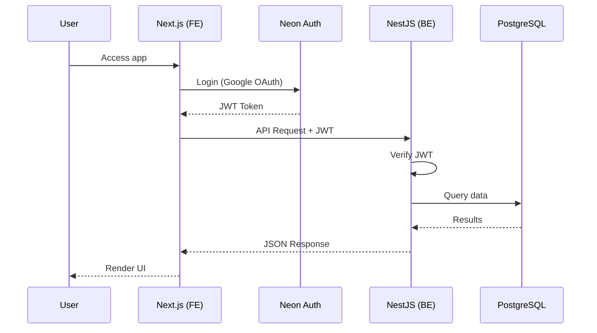

# System Architecture Diagram

## NOVA Platform - System Architecture

## Diagram giải thích

### 🖥️ Client Layer

- Web browsers (Chrome, Firefox, Safari)
- Mobile browsers (responsive design)

### 📱 Presentation Layer (Next.js FE)

- **Next.js 16**: App Router, Server Components
- **React 19**: UI framework
- **Tailwind + shadcn/ui**: Styling

### ⚙️ Server Layer (NestJS BE)

- **NestJS**: Backend framework
- **REST API**: HTTP endpoints
- **Guards**: JWT verification, role-based access

### 💾 Data Layer

- **PostgreSQL**: Main database
- **Neon Serverless**: Managed PostgreSQL
- **neon_auth schema**: Auth tables (users, sessions)

### 🔌 3rd Party Services

- **Neon Auth**: Authentication service
- **Google OAuth**: Social login
- **Cloudinary**: Image/file storage (planned)
- **PayOS**: VN payment gateway (planned)

---

## Data Flow

