# Neon Auth Migration: Stack Auth → Better Auth

## 📋 Tổng quan

Document này giải thích sự chuyển đổi từ **Stack Auth (legacy)** sang **Better Auth** trong Neon, bao gồm lý do, so sánh, và hướng dẫn migration chi tiết.

## 🏷️ Status hiện tại


### **Important Notice:**

⚠️ **Stack Auth (Legacy) Status:**

- ❌ No longer accepting new users
- ✅ Still supported for existing users
- 📚 Migration guide available
- 🔄 Encouraged to migrate to Better Auth

## 🎯 Tại sao chuyển từ Stack Auth sang Better Auth?

### **1. Native Branching Support**


**Better Auth:**

- ✅ Authentication branches **automatically** with database
- ✅ Each branch gets **isolated** users, sessions, auth config
- ✅ Perfect for **preview environments** and testing
- ✅ No manual setup per branch

**Stack Auth:**

- ❌ Single auth instance for all environments
- ❌ Manual configuration per environment
- ❌ Risk of mixing test/prod data

### **2. Database as Source of Truth**


**Better Auth:**

- ✅ Neon database is **single source of truth**
- ✅ No webhooks needed
- ✅ No sync delays
- ✅ No external dependencies
- ✅ Query users directly with SQL

**Stack Auth:**

- ❌ External auth service
- ❌ Webhook-based sync
- ❌ Potential sync delays
- ❌ Additional failure points

### **3. Simplified Configuration**


**Environment Variables:**

| Stack Auth (Old)            | Better Auth (New)      |
| --------------------------- | ---------------------- |
| 4 environment variables     | 1 environment variable |
| Multiple API keys to manage | Single Auth URL        |
| Complex configuration       | Simple configuration   |

### **4. Open-Source Foundation**


## 📊 So sánh chi tiết

### **Feature Comparison**

| Feature                   | Stack Auth (Legacy) | Better Auth (Current) |
| ------------------------- | ------------------- | --------------------- |
| **Status**                | ❌ Deprecated       | ✅ Active (Beta)      |
| **New Users**             | ❌ Not accepted     | ✅ Recommended        |
| **Existing Users**        | ✅ Still supported  | ✅ Should migrate     |
| **Environment Variables** | 4 variables         | 1 variable            |
| **Database Integration**  | Via webhooks        | Native/Direct         |
| **Branching Support**     | ❌ No               | ✅ Yes                |
| **Sync Delays**           | ⚠️ Possible         | ✅ None               |
| **Setup Complexity**      | 🔴 High             | 🟢 Low                |
| **Open Source**           | ❌ No               | ✅ Yes                |
| **RLS Integration**       | ⚠️ Complex          | ✅ Built-in           |
| **SQL Access**            | ❌ Limited          | ✅ Full access        |

### **Architecture Comparison**


## 🔄 Migration Guide

### **Step 1: Environment Variables**

```diff
# .env (BEFORE - Stack Auth)
- NEXT_PUBLIC_STACK_PROJECT_ID=your-project-id
- NEXT_PUBLIC_STACK_PUBLISHABLE_CLIENT_KEY=your-client-key
- STACK_SECRET_SERVER_KEY=your-server-secret
- STACK_API_URL=https://...

# .env (AFTER - Better Auth)
+ NEON_AUTH_BASE_URL=https://ep-xxx.neonauth.us-east-2.aws.neon.tech/neondb/auth
```

**Notes:**

- ✅ 1 variable thay vì 4
- ✅ Lấy từ Neon Console → Auth → Configuration
- ⚠️ React SPA dùng `VITE_NEON_AUTH_URL`

### **Step 2: Install Packages**

```bash
# Uninstall Stack Auth
npm uninstall @stackframe/stack

# Install Better Auth
npm install @neondatabase/auth
```

### **Step 3: Update SDK Initialization**

#### **❌ Before (Stack Auth)**

```typescript
// stack.ts
import { StackServerApp } from "@stackframe/stack";

export const stackServerApp = new StackServerApp({
  tokenStore: "nextjs-cookie",
});
```

#### **✅ After (Better Auth)**

```typescript
// lib/auth/client.ts
"use client";
import { createAuthClient } from "@neondatabase/auth/next";

export const authClient = createAuthClient();

// lib/auth/server.ts
import { createAuthServer } from "@neondatabase/auth/next/server";

export const authServer = createAuthServer();
```

**What changed:**

- Không cần manual config
- SDK tự đọc `process.env.NEON_AUTH_BASE_URL`
- Tách riêng client/server

### **Step 4: Replace Components**

#### **Sign In Page**

```diff
# ❌ Before (Stack Auth)
- import { SignIn } from '@stackframe/stack';
-
- export default function SignInPage() {
-   return <SignIn />;
- }

# ✅ After (Better Auth)
+ import { AuthView } from '@neondatabase/auth/react';
+
+ export default async function SignInPage({ params }) {
+   const { path } = await params;
+   return <AuthView path={path} />;
+ }
```

#### **Sign Up Page**

```diff
# ❌ Before (Stack Auth)
- import { SignUp } from '@stackframe/stack';
-
- export default function SignUpPage() {
-   return <SignUp />;
- }

# ✅ After (Better Auth)
+ import { AuthView } from '@neondatabase/auth/react';
+
+ export default async function SignUpPage({ params }) {
+   const { path } = await params;
+   return <AuthView path={path} />;
+ }
```

**What changed:**

- Dùng chung `AuthView` component
- Điều khiển bằng `path` prop
- Dynamic routing

#### **User Button**

```diff
# ❌ Before (Stack Auth)
- import { UserButton } from '@stackframe/stack';
-
- export function Header() {
-   return <UserButton />;
- }

# ✅ After (Better Auth)
+ 'use client';
+ import { UserButton } from '@neondatabase/auth/react';
+
+ export function Header() {
+   return <UserButton size="icon" />;
+ }
```

**What changed:**

- Same API
- Must mark as `'use client'`
- Import từ Neon package

### **Step 5: Replace Hooks**

#### **useUser Hook**

```diff
# ❌ Before (Stack Auth)
- 'use client';
- import { useUser } from '@stackframe/stack';
-
- export function MyComponent() {
-   const user = useUser();
-   return <div>{user ? `Hello, ${user.displayName}` : 'Not logged in'}</div>;
- }

# ✅ After (Better Auth)
+ 'use client';
+ import { authClient } from '@/lib/auth/client';
+ import { useEffect, useState } from 'react';
+
+ export function MyComponent() {
+   const [session, setSession] = useState(null);
+
+   useEffect(() => {
+     authClient.getSession().then(({ data }) => setSession(data));
+   }, []);
+
+   const user = session?.user;
+   return <div>{user ? `Hello, ${user.name}` : 'Not logged in'}</div>;
+ }
```

**What changed:**

- Call `authClient.getSession()`
- Read `user` from `session.user`
- Manage state manually (or use `useSession` hook)

### **Step 6: Update Provider Setup**

```diff
# ❌ Before (Stack Auth)
- import { StackProvider, StackTheme } from '@stackframe/stack';
- import { stackServerApp } from './stack';
-
- export default function RootLayout({ children }) {
-   return (
-     <StackProvider app={stackServerApp}>
-       <StackTheme>{children}</StackTheme>
-     </StackProvider>
-   );
- }

# ✅ After (Better Auth)
+ import { authClient } from '@/lib/auth/client';
+ import { NeonAuthUIProvider, UserButton } from '@neondatabase/auth/react';
+ import '@neondatabase/auth/ui/tailwind';
+
+ export default function RootLayout({ children }) {
+   return (
+     <html lang="en" suppressHydrationWarning>
+       <body>
+         <NeonAuthUIProvider
+           authClient={authClient}
+           redirectTo="/account/settings"
+           emailOTP
+         >
+           <header>
+             <UserButton size="icon" />
+           </header>
+           {children}
+         </NeonAuthUIProvider>
+       </body>
+     </html>
+   );
+ }
```

**What changed:**

- Wrap với `NeonAuthUIProvider`
- Import auth styles
- Add `suppressHydrationWarning` to `<html>`

### **Step 7: Replace Auth Handler Route**

```diff
# ❌ Before (Stack Auth)
- // app/handler/[...stack]/page.tsx
- import { StackHandler } from '@stackframe/stack';
- import { stackServerApp } from '@/stack';
-
- export default function Handler(props: any) {
-   return <StackHandler fullPage app={stackServerApp} {...props} />;
- }

# ✅ After (Better Auth)
+ // app/api/auth/[...path]/route.ts
+ import { authApiHandler } from '@neondatabase/auth/next/server';
+
+ export const { GET, POST } = authApiHandler();
```

**What changed:**

- Move from page to API route
- Use `authApiHandler` to proxy auth APIs
- Simpler implementation

### **Step 8: Protect Routes**

#### **Component-level Protection**

```diff
# ❌ Before (Stack Auth)
- 'use client';
- import { useUser } from '@stackframe/stack';
-
- export default function ProtectedPage() {
-   const user = useUser({ or: 'redirect' });
-   return <div>Protected content</div>;
- }

# ✅ After (Better Auth)
+ 'use client';
+ import { SignedIn, SignedOut } from '@neondatabase/auth/react';
+
+ export default function ProtectedPage() {
+   return (
+     <>
+       <SignedIn>
+         <div>Protected content</div>
+       </SignedIn>
+       <SignedOut>
+         <div>Please sign in</div>
+       </SignedOut>
+     </>
+   );
+ }
```

#### **Middleware-based Protection**

```typescript
// middleware.ts (NEW with Better Auth)
import { neonAuthMiddleware } from "@neondatabase/auth/next/server";

export default neonAuthMiddleware({
  loginUrl: "/auth/sign-in",
});

export const config = {
  matcher: [
    "/dashboard/:path*",
    "/account/:path*",
    "/((?!_next/static|_next/image|favicon.ico).*)",
  ],
};
```

**What changed:**

- Declarative UI helpers (`<SignedIn>`, `<SignedOut>`)
- Optional middleware for edge protection
- Better separation of concerns

### **Step 9: Server-side User Access**

```diff
# ❌ Before (Stack Auth)
- import { stackServerApp } from '@/stack';
-
- export default async function ServerComponent() {
-   const user = await stackServerApp.getUser();
-   return <div>{user?.displayName}</div>;
- }

# ✅ After (Better Auth)
+ import { neonAuth } from '@neondatabase/auth/next/server';
+
+ export default async function ServerComponent() {
+   const { session, user } = await neonAuth();
+   return <div>{user?.name}</div>;
+ }
```

**What changed:**

- Use `neonAuth()` utility
- Returns both `session` and `user`
- Direct access in server components

## 🗄️ Database Schema Changes

### **Stack Auth Schema**


**Issues:**

- External database
- Webhook-based sync
- Delayed updates
- Potential inconsistency

### **Better Auth Schema**


**Advantages:**

- All data in your Neon database
- Direct SQL access
- Real-time consistency
- Branches with database

### **Query Examples**

```sql
-- View all users (Better Auth)
SELECT id, email, "emailVerified", "createdAt"
FROM neon_auth.user
ORDER BY "createdAt" DESC;

-- Check active sessions
SELECT
  s.id,
  s."userId",
  u.email,
  s."expiresAt"
FROM neon_auth.session s
JOIN neon_auth.user u ON s."userId" = u.id
WHERE s."expiresAt" > NOW();

-- OAuth accounts
SELECT
  u.email,
  a.provider,
  a."providerAccountId"
FROM neon_auth.account a
JOIN neon_auth.user u ON a."userId" = u.id
WHERE a.provider IN ('google', 'github');

-- Users by organization
SELECT
  u.email,
  o.name as org_name,
  om.role
FROM neon_auth.organization_member om
JOIN neon_auth.user u ON om."userId" = u.id
JOIN neon_auth.organization o ON om."organizationId" = o.id;
```

## 🚀 Migration Workflow

```mermaid
graph TB
    A[Start] --> B{Using Stack Auth?}
    B -->|No| C[✅ Use Better Auth<br/>directly]
    B -->|Yes| D{New project?}

    D -->|Yes| E[✅ Use Better Auth]
    D -->|No| F{Critical production?}

    F -->|Yes| G[Plan migration]
    F -->|No| H[Migrate now]

    G --> I[1. Test in dev]
    I --> J[2. Update staging]
    J --> K[3. Deploy production]

    H --> L[Follow migration guide]
    L --> M[Update env vars]
    M --> N[Replace packages]
    N --> O[Update code]
    O --> P[Test auth flows]
    P --> Q[Deploy]

    C --> Q
    E --> Q
    K --> Q

    Q --> R[✅ Done!]

    style C fill:#51cf66
    style E fill:#51cf66
    style R fill:#51cf66
```



### **Migration Checklist**

- [ ] **Backup current setup**
  - Export user data (if needed)
  - Document current env vars
  - Save Stack Auth config

- [ ] **Enable Neon Auth**
  - Go to Neon Console
  - Navigate to Auth tab
  - Click "Enable Neon Auth"
  - Copy Auth URL

- [ ] **Update environment variables**
  - Replace 4 Stack Auth vars with 1 Better Auth var
  - Test in `.env.local` first

- [ ] **Update dependencies**
  - `npm uninstall @stackframe/stack`
  - `npm install @neondatabase/auth`

- [ ] **Update code**
  - Replace SDK initialization
  - Update components
  - Replace hooks
  - Update provider setup
  - Replace auth routes
  - Update middleware

- [ ] **Test authentication**
  - Sign up new user
  - Sign in existing user
  - Test OAuth providers
  - Verify protected routes
  - Check user button
  - Test sign out

- [ ] **Test branching**
  - Create database branch
  - Verify auth data isolated
  - Test in preview environment

- [ ] **Deploy**
  - Deploy to staging
  - Full QA testing
  - Deploy to production
  - Monitor for issues

## 🔐 Security Considerations

### **Stack Auth (Old)**


**Concerns:**

- 4 API keys to secure
- Webhook endpoint security
- Potential sync issues
- External dependency

### **Better Auth (New)**

```mermaid
graph LR
    A[Your App] -->|1 Auth URL| B[Neon Auth]
    B -->|Direct| C[Neon DB]

    D[✅ Single URL] -.-> A
    E[✅ Direct connection] -.-> C
    F[✅ JWT validation] -.-> B

    style D fill:#51cf66
    style E fill:#51cf66
    style F fill:#51cf66
```



**Improvements:**

- ✅ Single Auth URL (simpler)
- ✅ Direct database connection
- ✅ Built-in JWT validation
- ✅ RLS integration
- ✅ No webhook risks

## 📚 Additional Resources

### **Official Documentation**

- [Neon Auth Overview](https://neon.com/docs/auth/overview)
- [Better Auth Documentation](https://www.better-auth.com/)
- [Migration Guide](https://neon.com/docs/auth/migrate/from-legacy-auth)
- [Quick Start (Next.js)](https://neon.com/docs/auth/quick-start/nextjs)

### **Community & Support**

- [Neon Discord](https://discord.gg/92vNTzKDGp)
- [Better Auth GitHub](https://github.com/better-auth/better-auth)
- [Neon GitHub Examples](https://github.com/neondatabase/neon-js)

### **Video Tutorials**

- [Neon YouTube Channel](https://www.youtube.com/@neondatabase)

## ⚠️ Eject to Stack Auth (If Needed)

Nếu bạn muốn tiếp tục dùng Stack Auth độc lập:

### **Step 1: Claim Project**

1. Go to Neon Console → Auth → Configuration
2. Click "Claim project"
3. Select Stack Auth account
4. Transfer ownership

### **Step 2: Update Environment Variables**

```env
# Use Stack Auth directly
NEXT_PUBLIC_STACK_PROJECT_ID=your-id
NEXT_PUBLIC_STACK_PUBLISHABLE_CLIENT_KEY=your-key
STACK_SECRET_SERVER_KEY=your-secret
```

### **Step 3: Manage Independently**

- ✅ Keep using `@stackframe/stack`
- ⚠️ No Neon Console management
- ⚠️ Manual updates & support
- ⚠️ No branching support

## 🎯 Recommendations

### **For New Projects:**

```mermaid
graph TD
    A[New Project] --> B[✅ Use Better Auth]
    B --> C[Simple setup]
    B --> D[Future-proof]
    B --> E[Best features]

    style B fill:#51cf66
    style C fill:#51cf66
    style D fill:#51cf66
    style E fill:#51cf66
```



**Reasons:**

- ✅ Latest features
- ✅ Active development
- ✅ Better documentation
- ✅ Simpler configuration
- ✅ Native branching

### **For Existing Projects:**

```mermaid
graph TD
    A[Existing Project] --> B{Stack Auth?}
    B -->|Yes| C[Plan Migration]
    B -->|No| D[Already Better Auth]

    C --> E[Low priority?]
    E -->|Yes| F[Keep for now]
    E -->|No| G[Migrate ASAP]

    D --> H[✅ You're good!]
    G --> H

    F -.Future.-> G

    style H fill:#51cf66
    style G fill:#4dabf7
```



**Decision Factors:**

- 📊 Project complexity
- 🕐 Available time
- 👥 Team size
- 🚀 Deployment frequency
- 🔄 Need for branching

## 🏁 Conclusion

### **Key Takeaways:**

1. **Stack Auth = Legacy**
   - ❌ Deprecated
   - ✅ Still supported for existing users
   - 🔄 Should migrate

2. **Better Auth = Future**
   - ✅ Recommended for all new projects
   - ✅ Simpler configuration (1 env var vs 4)
   - ✅ Native branching support
   - ✅ Database as source of truth
   - ✅ Open-source foundation

3. **Migration is Straightforward**
   - 📦 Replace package
   - 🔧 Update env vars
   - 💻 Update code (clear patterns)
   - ✅ Test and deploy

4. **Benefits are Significant**
   - 🚀 Better developer experience
   - 🔒 Enhanced security
   - ⚡ Real-time updates
   - 🌳 Branch-aware authentication
   - 📊 Direct SQL access

### **Final Recommendation:**

**Use Better Auth** for:

- ✅ All new projects
- ✅ Projects needing branching
- ✅ Serverless deployments
- ✅ Preview environments
- ✅ Modern development workflows

**Keep Stack Auth** only if:

- ⚠️ Critical production system
- ⚠️ No time to migrate now
- ⚠️ But plan migration soon

---

_Last updated: January 22, 2026_
_Based on Neon Auth documentation and Better Auth v1.4.6_
