# Neon Auth - Complete Guide

## Tổng quan

**Neon Auth** là managed authentication service được xây dựng trên **Better Auth**, lưu trữ users, sessions, và auth configuration **trực tiếp trong Neon database**. Khi bạn branch database, toàn bộ auth state cũng branch theo.


## Kiến trúc hệ thống

```mermaid
graph TB
    subgraph "Application Layer"
        A1[Next.js App]
        A2[React App]
        A3[Mobile App]
    end

    subgraph "SDK Layer"
        B[@neondatabase/auth]
    end

    subgraph "Neon Auth Service"
        C1[REST API]
        C2[JWT Generator]
        C3[OAuth Handler]
        C4[Session Manager]
    end

    subgraph "Database Layer"
        D1[neon_auth.user]
        D2[neon_auth.session]
        D3[neon_auth.account]
        D4[neon_auth.verification]
    end

    subgraph "External Services"
        E1[Google OAuth]
        E2[GitHub OAuth]
        E3[Other Providers]
    end

    A1 --> B
    A2 --> B
    A3 --> B

    B --> C1
    C1 --> C2
    C1 --> C3
    C1 --> C4

    C3 --> E1
    C3 --> E2
    C3 --> E3

    C2 --> D1
    C4 --> D2
    C3 --> D3
    C4 --> D4

    style B fill:#61dafb
    style C1 fill:#4dabf7
    style D1 fill:#00e699
```

## Authentication Flow - Sign In

### Complete Sign-In Process (4 Steps)


### Step 1: SDK Call

```typescript
const { data, error } = await client.auth.signIn.email({
  email: "user@example.com",
  password: "password",
});
```

**Request Flow:**

```mermaid
graph LR
    A[SDK Call] -->|POST| B[/auth/sign-in/email]
    B -->|Validate| C[neon_auth.account]
    C -->|Match| D[Generate Session]
    D --> E[Return Response]

    style D fill:#51cf66
```

**Response Structure:**

```json
{
  "data": {
    "session": {
      "access_token": "eyJhbGc...",
      "expires_at": 1763848395,
      "session_id": "sess_abc123",
      "user_id": "dc42fa70-09a7-4038-a3bb-f61dda854910"
    },
    "user": {
      "id": "dc42fa70-09a7-4038-a3bb-f61dda854910",
      "email": "user@example.com",
      "emailVerified": true,
      "name": "John Doe",
      "createdAt": "2026-01-20T10:00:00Z"
    }
  }
}
```

### Step 2: Session Cookie


**Cookie Details:**

- **Name:** `__Secure-neonauth.session_token`
- **Type:** HTTP-only (JavaScript không thể đọc)
- **Content:** Opaque session token (KHÔNG phải JWT)
- **Security:** HTTPS only, Auto-sent với mọi request
- **Management:** SDK tự động quản lý

### Step 3: JWT Token Structure


**JWT Payload Example:**

```json
{
  "sub": "dc42fa70-09a7-4038-a3bb-f61dda854910",
  "email": "user@example.com",
  "role": "authenticated",
  "exp": 1763848395,
  "iat": 1763847495,
  "aud": "authenticated",
  "iss": "neon-auth"
}
```

### Step 4: Database Query với JWT


**Code Example:**

```typescript
// JWT tự động được thêm vào header
const { data } = await client.from("posts").select("*");

// Internally:
// Authorization: Bearer eyJhbGc...
// JWT → validate → extract user_id → RLS
```

## Sign-Up Flow

```mermaid
sequenceDiagram
    participant User
    participant App
    participant Auth as Neon Auth
    participant DB as Database
    participant Email as Email Service

    User->>App: Fill sign-up form
    App->>Auth: POST /auth/sign-up/email

    Auth->>DB: Check if email exists

    alt Email Already Exists
        Auth-->>App: Error: Email taken
        App-->>User: Show error
    else New Email
        Auth->>DB: Insert into neon_auth.user
        Auth->>DB: Hash password → neon_auth.account

        alt Email Verification Enabled
            Auth->>DB: Create token → neon_auth.verification
            Auth->>Email: Send verification email
            Auth-->>App: Return user (no session yet)
            App-->>User: Check your email
        else No Email Verification
            Auth->>DB: Create session
            Auth-->>App: Return {user, session}
            App-->>User: Redirect to dashboard
        end
    end
```



**Sign-Up Code:**

```typescript
const { data, error } = await client.auth.signUp.email({
  email: "newuser@example.com",
  password: "securepassword",
  name: "New User",
});
```

**Database Operations:**


## OAuth Flow (Google, GitHub, etc.)


**OAuth Code Example:**

```typescript
// Initiate OAuth flow
await client.auth.signIn.social({
  provider: "google",
  callbackURL: "http://localhost:3000/auth/callback",
});

// Handle callback (automatic with SDK)
// User will be redirected back with session
```

**OAuth Providers Support:**


## Database Schema `neon_auth`


**Query Examples:**

```sql
-- View all users
SELECT id, email, "emailVerified", "createdAt"
FROM neon_auth.user
ORDER BY "createdAt" DESC;

-- Check active sessions
SELECT s.id, s."userId", u.email, s."expiresAt"
FROM neon_auth.session s
JOIN neon_auth.user u ON s."userId" = u.id
WHERE s."expiresAt" > NOW();

-- OAuth accounts
SELECT u.email, a.provider, a."providerAccountId"
FROM neon_auth.account a
JOIN neon_auth.user u ON a."userId" = u.id
WHERE a.provider IN ('google', 'github');
```

## Integration với Data API & RLS

### Row Level Security Flow


### RLS Policy Examples

```sql
-- 1. Users can only view their own posts
CREATE POLICY "Users view own posts"
ON posts FOR SELECT
TO authenticated
USING (user_id = auth.uid());

-- 2. Users can insert their own posts
CREATE POLICY "Users create own posts"
ON posts FOR INSERT
TO authenticated
WITH CHECK (user_id = auth.uid());

-- 3. Public posts visible to everyone
CREATE POLICY "Public posts visible"
ON posts FOR SELECT
TO anon, authenticated
USING (is_public = true);

-- 4. Admin can see everything
CREATE POLICY "Admin sees all"
ON posts FOR SELECT
TO authenticated
USING (
  EXISTS (
    SELECT 1 FROM neon_auth.user
    WHERE id = auth.uid()
    AND role = 'admin'
  )
);
```

**RLS + Neon Auth Architecture:**


## Branching Authentication

### Branch-Aware Auth


**Branch Isolation:**


### Use Cases for Branching


**Workflow Example:**


## Setup & Configuration

### 1. Enable Neon Auth

```bash
# Method 1: CLI
npx neonctl auth enable

# Method 2: Console
# Go to Neon Console → Project → Auth → Enable
```

### 2. Install SDK

```bash
npm install @neondatabase/neon-js
```

### 3. Create Auth Client

```typescript
// src/lib/auth.ts
import { createAuthClient } from "@neondatabase/neon-js/auth";

export const authClient = createAuthClient(
  process.env.NEXT_PUBLIC_NEON_AUTH_URL!,
);
```

### 4. Setup with UI Components

```typescript
// src/app/layout.tsx
import { NeonAuthUIProvider } from '@neondatabase/neon-js/auth/react/ui';
import { authClient } from '@/lib/auth';

export default function RootLayout({ children }) {
  return (
    <html>
      <body>
        <NeonAuthUIProvider authClient={authClient}>
          {children}
        </NeonAuthUIProvider>
      </body>
    </html>
  );
}
```

### 5. Auth Pages

```typescript
// src/app/sign-in/page.tsx
import { AuthView } from '@neondatabase/neon-js/auth/react/ui';

export default function SignInPage() {
  return <AuthView pathname="sign-in" />;
}

// src/app/sign-up/page.tsx
export default function SignUpPage() {
  return <AuthView pathname="sign-up" />;
}
```

## Advanced Features

### 1. Custom Auth UI

```typescript
// Build your own UI with auth methods
import { authClient } from "@/lib/auth";

async function handleSignIn(email: string, password: string) {
  const { data, error } = await authClient.signIn.email({
    email,
    password,
  });

  if (error) {
    console.error("Sign in failed:", error);
    return;
  }

  console.log("Signed in:", data.user);
  // Redirect to dashboard
}
```

### 2. Session Management

```typescript
// Get current session
const { data: session } = await authClient.getSession();

// Sign out
await authClient.signOut();

// Refresh session
await authClient.refreshSession();
```

### 3. Email Verification


**Enable Email Verification:**

```typescript
// Console: Auth Settings → Email Verification → Enable

// SDK automatically handles verification flow
const { data } = await authClient.signUp.email({
  email: "user@example.com",
  password: "password",
});

// User receives email with verification link
// Click link → auto-verified
```

### 4. Password Reset


## Security Best Practices

```mermaid
graph TB
    A[Security Checklist] --> B[Cookie Security]
    A --> C[JWT Validation]
    A --> D[RLS Policies]
    A --> E[Rate Limiting]
    A --> F[Email Verification]

    B --> B1[HttpOnly: true]
    B --> B2[Secure: true]
    B --> B3[SameSite: None]

    C --> C1[JWKS validation]
    C --> C2[Expiry checks]
    C --> C3[Signature verification]

    D --> D1[Enable RLS]
    D --> D2[Test policies]
    D --> D3[Audit access]

    E --> E1[Login attempts]
    E --> E2[API rate limits]

    F --> F1[Required for signups]
    F --> F2[Verification links]

    style B1 fill:#51cf66
    style C1 fill:#51cf66
    style D1 fill:#51cf66
```

### Security Checklist

✅ **Always use HTTPS** in production
✅ **Enable email verification** to prevent spam signups
✅ **Implement RLS policies** for data access control
✅ **Rate limit** authentication endpoints
✅ **Rotate JWT secrets** periodically
✅ **Monitor** failed login attempts
✅ **Use environment variables** for secrets
✅ **Enable 2FA** (coming soon)

## Pricing

```mermaid
graph LR
    A[Free Plan<br/>60k MAU] --> B[Launch Plan<br/>1M MAU]
    B --> C[Scale Plan<br/>1M MAU]
    C --> D[Enterprise<br/>Custom]

    style A fill:#51cf66
    style B fill:#4dabf7
    style C fill:#7950f2
```

| Plan           | Monthly Active Users (MAU) | Price         |
| -------------- | -------------------------- | ------------- |
| **Free**       | Up to 60,000               | $0            |
| **Launch**     | Up to 1M                   | Included      |
| **Scale**      | Up to 1M                   | Included      |
| **Enterprise** | >1M                        | Contact Sales |

**MAU Definition:** Unique user authenticates ≥1 time/month

## Troubleshooting

### Common Issues

```mermaid
graph TB
    A{Issue Type} --> B[JWT Invalid]
    A --> C[Session Expired]
    A --> D[OAuth Failed]
    A --> E[RLS Denied]

    B --> B1[Check JWKS URL]
    B --> B2[Verify token format]

    C --> C1[Refresh session]
    C --> C2[Re-authenticate]

    D --> D1[Check OAuth config]
    D --> D2[Verify callback URL]

    E --> E1[Review RLS policies]
    E --> E2[Check auth.uid]

    style B fill:#ff6b6b
    style C fill:#ff6b6b
    style D fill:#ff6b6b
    style E fill:#ff6b6b
```

### Debug Commands

```typescript
// 1. Check current session
const session = await authClient.getSession();
console.log("Session:", session);

// 2. Decode JWT (client-side only for debugging)
const token = session.data?.session?.access_token;
if (token) {
  const payload = JSON.parse(atob(token.split(".")[1]));
  console.log("JWT Payload:", payload);
}

// 3. Test RLS
// Query database directly to see RLS in action
```

```sql
-- Check user in database
SELECT * FROM neon_auth.user WHERE email = 'test@example.com';

-- Check active sessions
SELECT * FROM neon_auth.session WHERE "userId" = 'xxx';

-- Test RLS policy
SET LOCAL auth.uid = 'your-user-id';
SELECT * FROM posts; -- Should only see user's posts
```

## Migration from Other Auth Solutions

### From NextAuth/Auth.js

```mermaid
graph LR
    A[NextAuth] -->|Migrate| B[Neon Auth]
    A1[next-auth schema] -->|Transform| B1[neon_auth schema]
    A2[Database session] --> B2[Database session]
    A3[OAuth providers] --> B3[OAuth providers]

    style B fill:#51cf66
```

### From Clerk/Supabase Auth

```mermaid
graph TB
    A[Export Users] --> B[Transform Data]
    B --> C[Import to neon_auth.user]
    C --> D[Update Auth Client]
    D --> E[Test Authentication]

    style C fill:#4dabf7
    style E fill:#51cf66
```

## Resources

- 📚 [Neon Auth Docs](https://neon.com/docs/auth/overview)
- 🎓 [Better Auth Docs](https://www.better-auth.com/)
- 💬 [Discord Support](https://discord.gg/92vNTzKDGp)
- 🐙 [GitHub Examples](https://github.com/neondatabase/neon-js)
- 📹 [Video Tutorials](https://www.youtube.com/@neondatabase)

## Conclusion

**Neon Auth** cung cấp:

- ✅ Managed authentication service
- ✅ Branch-aware auth (test isolated)
- ✅ Built-in JWT + RLS integration
- ✅ OAuth providers out-of-the-box
- ✅ Zero infrastructure management
- ✅ Generous free tier (60k MAU)

**Perfect for:**

- 🚀 Serverless applications
- 🧪 Preview environments
- 💰 Cost-sensitive projects
- ⚡ Quick prototypes
- 🔒 RLS-based security model

**Recommended Stack:**

```
Next.js + Neon Auth + Data API + RLS + Vercel
```

---

_Last updated: January 22, 2026_
