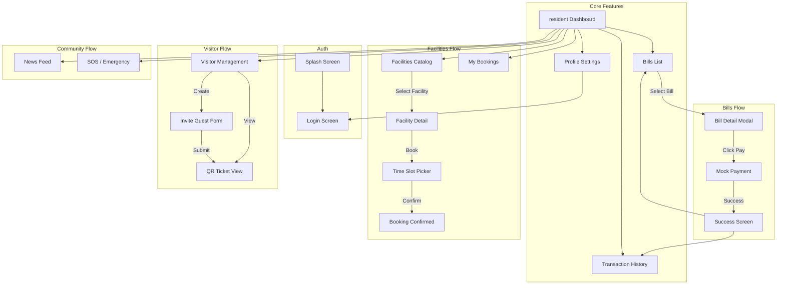

# NOVA Screen Flow

## Navigation Map

Biểu đồ dưới đây mô tả luồng di chuyển giữa các màn hình trong ứng dụng NOVA (Mobile/Web App).

## Screen Descriptions

1.  **Splash Screen**: Logo NOVA, loading state.
2.  **Login Screen**: "Sign in with Google" button.
3.  **Resident Dashboard**: Trung tâm điều khiển chính.
    - Bottom Tab Bar: Home, Bills, Facilities, Profile.
4.  **Bills List**: Danh sách hóa đơn (Tabs: Unpaid, All).
5.  **Bill Detail**: Chi tiết phí, nút thanh toán.
6.  **Facilities Catalog**: Danh sách tiện ích (Grid view).
7.  **Invite Guest Form**: Form nhập thông tin khách.
8.  **QR Ticket View**: Hiển thị mã QR để chia sẻ.
