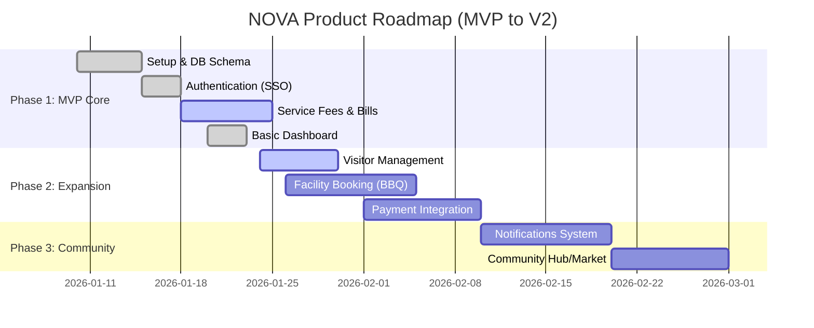

# Outcome 1: Presentation Preparation Material

Document này tổng hợp nội dung cần thiết để bạn điền vào **Product Market Fit Canvas** và chuẩn bị slide **Architecture/Roadmap** cho bài thuyết trình Checklist 1.

---

## 1. Product Market Fit Canvas [Pre-Launch]

Dưới đây là nội dung đề xuất cho 8 ô của Canvas dựa trên dự án NOVA:

### 1.1. Characteristics & Jobs to be done

- **Stakeholders**:
  - **Primary**: Cư dân chung cư (Residents) - Những người trẻ/gia đình bận rộn.
  - **Secondary**: Ban quản lý (Property Managers), Bảo vệ (Security), Nhân viên kỹ thuật.
- **Jobs to be done**:
  - Thanh toán phí dịch vụ đúng hạn mà không cần nhớ ngày.
  - Đặt tiện ích (BBQ, Hồ bơi) nhanh chóng không cần gọi điện.
  - Mời khách đến chơi nhà mà không cần xuống đón.

### 1.2. Alternatives (Giải pháp thay thế hiện tại)

- **Thanh toán**: Chuyển khoản thủ công qua ngân hàng (dễ sai nội dung), đóng tiền mặt tại văn phòng (mất công đi lại).
- **Thông báo**: Dán giấy ở thang máy, Zalo group (dễ trôi tin).
- **Tiện ích**: Sổ đăng ký giấy tại quầy lễ tân.

### 1.3. Problems & Needs

- **Vấn đề (Pain points)**:
  - Quên đóng phí dẫn đến bị cắt nước/điện hoặc phạt.
  - Không minh bạch trong lịch sử thanh toán.
  - Quy trình đăng ký khách/tiện ích thủ công, tốn thời gian.
- **Nhu cầu**: Một ứng dụng "All-in-one" trên điện thoại để quản lý mọi việc liên quan đến căn hộ.

### 1.4. Key Features (Giải pháp của NOVA)

- **Thanh toán**: Xem hóa đơn, nhắc nợ tự động, thanh toán 1 chạm.
- **Tiện ích**: Đặt lịch BBQ/Gym online, check lịch trống real-time.
- **Khách**: Tạo QR code vé mời cho khách, check-in tự động.
- **Minh bạch**: Lịch sử giao dịch và hóa đơn lưu trữ vĩnh viễn.

### 1.5. Channel (Kênh tiếp cận)

- **Marketing**: Giới thiệu qua Ban quản lý tòa nhà, Poster tại thang máy/sảnh chính, Email chào mừng cư dân mới.
- **Distribution**: Web App (PWA) truy cập trực tiếp qua browser (không cần cài đặt phức tạp), Link gửi qua Zalo/SMS.

### 1.6. Value for the Channel

- **Web App**: Triển khai nhanh, update không cần duyệt qua App Store, dễ dàng tích hợp vào quy trình onboarding của tòa nhà.
- **Direct Sales (B2B2C)**: Hợp tác với Ban quản lý giúp tiếp cận 100% cư dân mục tiêu ngay lập tức.

### 1.7. User Experience (Trải nghiệm người dùng)

- **Cảm xúc**: An tâm (không lo quên nợ), Tiện lợi (mọi thứ trong tầm tay), Hiện đại (Smart Living).
- **Hành trình**: Login Google -> Thấy ngay số nợ -> Thanh toán trong 3 click -> Nhận thông báo xác nhận ngay lập tức -> Cảm thấy hoàn thành nhiệm vụ ("Relieved").

### 1.8. Key Metrics (Chỉ số đo lường)

- **Activation**: \% Cư dân đăng nhập lần đầu tiên trong tuần đầu ra mắt.
- **Retention**: \% Cư dân quay lại app hàng tháng để thanh toán.
- **Engagement**: Số lượng Booking tiện ích và Vé mời khách được tạo hàng tuần.

---

## 2. Architecture & Tech Stack

### 2.1. Core Tech Stack (Diagram)

```mermaid
graph TD
    User[Resident / User]

    subgraph Frontend [Presentation Layer]
        NextJS[Next.js 16 Web App]
        UI[shadcn/ui + Tailwind]
        Zustand[State Management]
    end

    subgraph Backend [Logic Layer]
        NestJS[NestJS API Server]
        AuthGuard[JWT Auth Guard]
        Modules[Modules: Bills, Facilities, Visitors...]
    end

    subgraph Infrastructure [Data Layer]
        Neon[Neon Auth (OAuth)]
        Postgres[PostgreSQL Database]
        Drizzle[Drizzle ORM]
    end

    User -->|HTTPS| NextJS
    NextJS -->|REST API| NestJS
    NestJS -->|Query| Drizzle
    Drizzle -->|SQL| Postgres
    NextJS -.->|Auth| Neon
    NestJS -.->|Verify Token| Neon
```

### 2.2. Product Roadmap (Gantt Chart)



---

## 3. AI Disclosure Statement (Bắt buộc)

_Copy đoạn này vào slide cuối hoặc báo cáo:_

> **AI Disclosure**:
> In the development of NOVA, we utilized AI assistants (specifically Large Language Models) to accelerate the development process.
>
> - **Usage**: The AI was used for generating boilerplate code (NestJS modules, UI components), debugging database schema conflicts, drafting documentation (functional specs, user flows), and optimizing SQL queries.
> - **Verification**: All AI-generated code and content were reviewed, tested, and modified by the development team to ensure accuracy, security, and alignment with project requirements. We maintain full ownership and understanding of the codebase.
