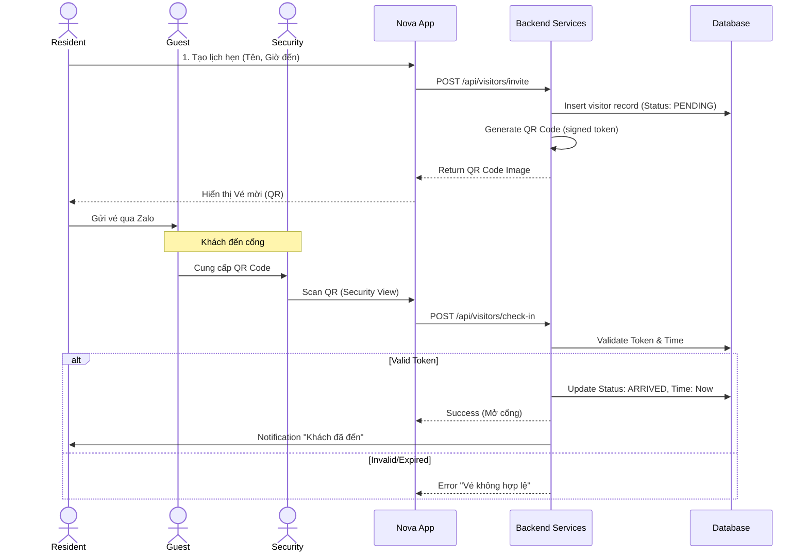

# Visitor Management Module - Implementation Plan

## 1. User Journey (Luồng người dùng)

Chức năng **"Khách đến thăm" (Smart Guest Access)** giúp cư dân đăng ký trước cho khách, giảm thiểu thời gian chờ đợi tại cổng an ninh và tăng cường kiểm soát ra vào.

### Quy trình chính (Happy Path)

1.  **Đăng ký (Resident)**: Cư dân đăng nhập, chọn "Mời khách". Nhập thông tin khách (Tên, BKS xe, Thời gian đến).
2.  **Tạo vé (System)**: Hệ thống tạo ra một **QR Code** hoặc **Mã Access Code** (6 số) gửi lại cho cư dân.
3.  **Chia sẻ (Resident)**: Cư dân gửi QR Code này cho khách qua Zalo/Messenger.
4.  **Check-in (Guest/Security)**: Khách đến cổng, đưa QR cho bảo vệ quét (hoặc đọc mã số).
5.  **Xác thực (System)**: Hệ thống kiểm tra mã hợp lệ, đúng khung giờ.
6.  **Thông báo (System)**: Gửi thông báo cho cư dân "Khách Nguyễn Văn A đã đến".
7.  **Lưu vết**: Hệ thống ghi nhận thời gian check-in.

---

## 2. Sequence Diagram (Biểu đồ tuần tự)



---

## 3. Database Schema Design

Cần thêm bảng `visitors` vào cơ sở dữ liệu.

```sql
CREATE TABLE visitors (
  id SERIAL PRIMARY KEY,
  resident_id INTEGER REFERENCES users(id) NOT NULL,

  -- Guest Info
  guest_name VARCHAR(100) NOT NULL,
  phone_number VARCHAR(20),
  vehicle_plate VARCHAR(20), -- Biển số xe (để bảo vệ check nhanh)

  -- Visit Details
  expected_arrival TIMESTAMP NOT NULL,
  expected_departure TIMESTAMP,
  purpose VARCHAR(255), -- "Giao hàng", "Bạn bè", "Thợ sửa"

  -- Access Control
  access_code VARCHAR(100) UNIQUE NOT NULL, -- Mã dùng để tạo QR
  qr_image_url TEXT, -- (Optional) Cache link ảnh

  -- Status
  status VARCHAR(50) DEFAULT 'pending', -- pending | arrived | expired | cancelled
  check_in_at TIMESTAMP,
  check_out_at TIMESTAMP,

  created_at TIMESTAMP DEFAULT CURRENT_TIMESTAMP
);
```

---

## 4. API Endpoints cần xây dựng

### Cho Cư dân (Resident)

1.  `GET /api/visitors`: Xem lịch sử khách mời.
2.  `POST /api/visitors/invite`: Tạo vé mời mới.
3.  `PATCH /api/visitors/:id/cancel`: Hủy vé.

### Cho Bảo vệ (Security - Simulated)

1.  `POST /api/visitors/match`: Kiểm tra thông tin QR code.
2.  `POST /api/visitors/check-in`: Xác nhận khách vào.

---

## 5. UI Components cần có

1.  **Invites List**: Card hiển thị các vé mời đang active và đã qua.
2.  **Create Invite Form**: Form nhập (DatePicker, Input tên, Input biển số).
3.  **QR Ticket View**: Modal hiển thị QR code to rõ để share.
